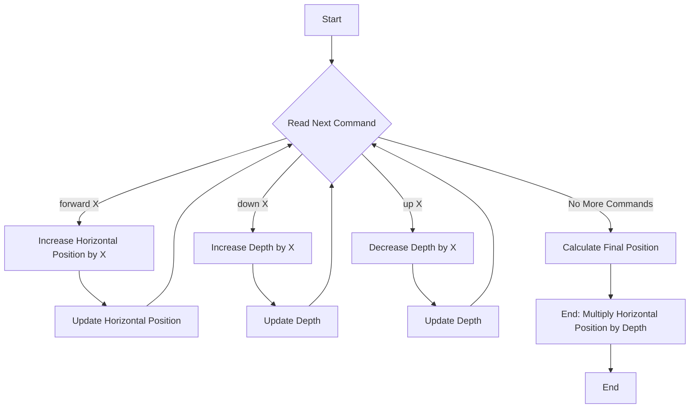

```mermaid
graph TD
    A[Start] --> B{Read Next Command}
    B -->|forward X| C[Increase Horizontal Position by X]
    B -->|down X| D[Increase Depth by X]
    B -->|up X| E[Decrease Depth by X]
    B -->|No More Commands| F[Calculate Final Position]
    C --> G[Update Horizontal Position]
    D --> H[Update Depth]
    E --> I[Update Depth]
    G --> B
    H --> B
    I --> B
    F --> J[End: Multiply Horizontal Position by Depth]
    J --> K[End]
```
