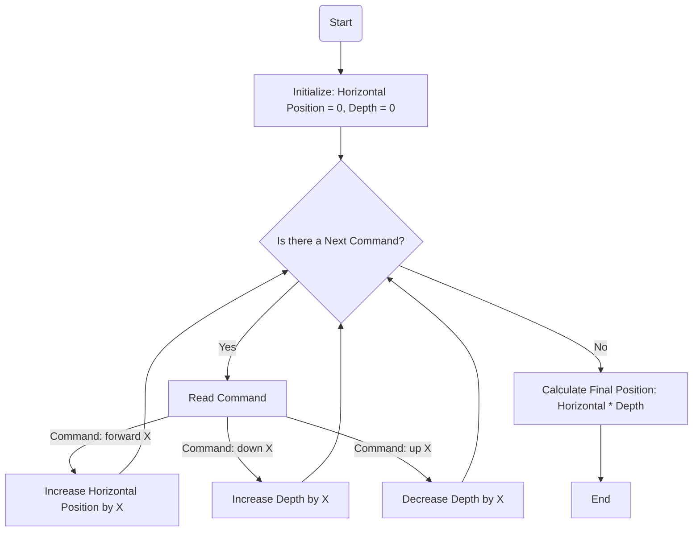

```mermaid
graph TD
    A(Start) --> B[Initialize: Horizontal Position = 0, Depth = 0]
    B --> C{Is there a Next Command?}
    C -->|Yes| D[Read Command]
    D -->|Command: forward X| E[Increase Horizontal Position by X]
    D -->|Command: down X| F[Increase Depth by X]
    D -->|Command: up X| G[Decrease Depth by X]
    E --> C
    F --> C
    G --> C
    C -->|No| H[Calculate Final Position: Horizontal * Depth]
    H --> I[End]
```
