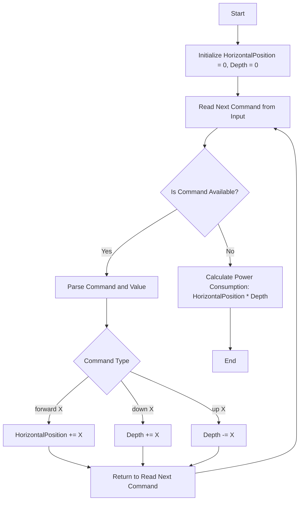

```mermaid
graph TD
    A[Start] --> B[Initialize HorizontalPosition = 0, Depth = 0]
    B --> C[Read Next Command from Input]
    C --> D{Is Command Available?}
    D -->|Yes| E[Parse Command and Value]
    E --> F{Command Type}
    F -->|forward X| G[HorizontalPosition += X]
    F -->|down X| H[Depth += X]
    F -->|up X| I[Depth -= X]
    G --> J[Return to Read Next Command]
    H --> J
    I --> J
    J --> C
    D -->|No| K[Calculate Power Consumption: HorizontalPosition * Depth]
    K --> L[End]
```
