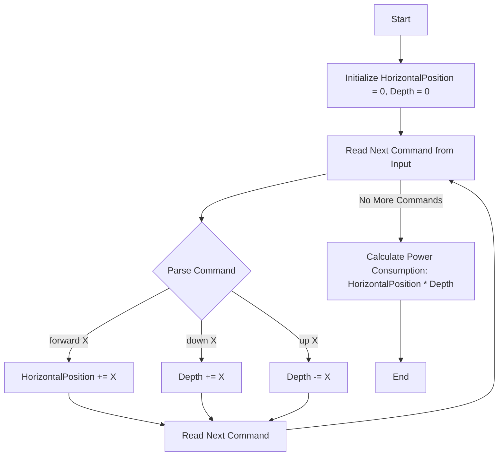

```mermaid
graph TD
    A[Start] --> B[Initialize HorizontalPosition = 0, Depth = 0]
    B --> C[Read Next Command from Input]
    C -->|No More Commands| K[Calculate Power Consumption: HorizontalPosition * Depth]
    C --> D{Parse Command}
    D -->|forward X| E[HorizontalPosition += X]
    D -->|down X| F[Depth += X]
    D -->|up X| G[Depth -= X]
    E --> H[Read Next Command]
    F --> H
    G --> H
    H --> C
    K --> L[End]
```
