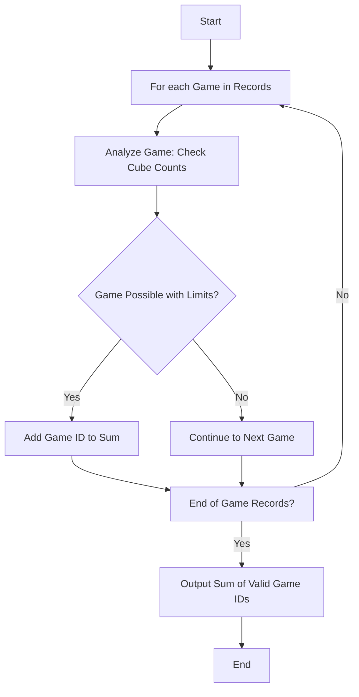

```mermaid
graph TD
    A[Start] --> B[For each Game in Records]
    B --> C[Analyze Game: Check Cube Counts]
    C --> D{Game Possible with Limits?}
    D -->|Yes| E[Add Game ID to Sum]
    D -->|No| F[Continue to Next Game]
    E --> G[End of Game Records?]
    F --> G
    G -->|No| B
    G -->|Yes| H[Output Sum of Valid Game IDs]
    H --> I[End]
```
