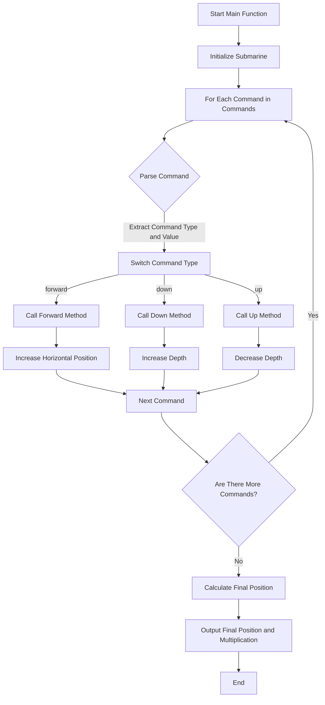

```mermaid
graph TD
    A[Start Main Function] --> B[Initialize Submarine]
    B --> C[For Each Command in Commands]
    C --> D{Parse Command}
    D -->|Extract Command Type and Value| E[Switch Command Type]
    E -->|forward| F[Call Forward Method]
    E -->|down| G[Call Down Method]
    E -->|up| H[Call Up Method]
    F --> I[Increase Horizontal Position]
    G --> J[Increase Depth]
    H --> K[Decrease Depth]
    I --> L[Next Command]
    J --> L
    K --> L
    L --> M{Are There More Commands?}
    M -->|Yes| C
    M -->|No| N[Calculate Final Position]
    N --> O[Output Final Position and Multiplication]
    O --> P[End]
```
